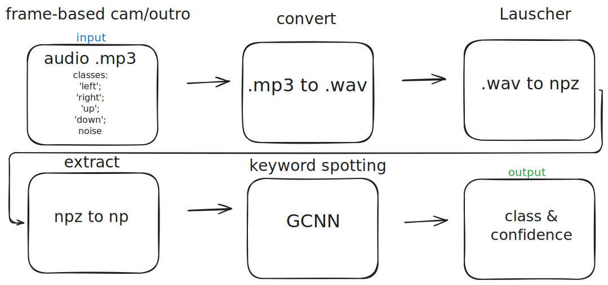
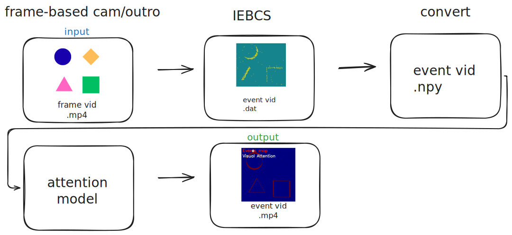

# Keyword Spotting-Driven Attention Bias for Vision: playground

This repository aims to explore initial strategies for using the output of an FPGA-implemented Graph Convolutional Neural Network (GCNN) for keyword spotting (KWS) to generate a spatial bias in an event-driven camera's attention model. The core challenge is bridging the gap between a discrete keyword detection and a continuous, spatial attention bias.

## System Overview

### Components: 
- Waveform to event audio converter 
- GCNN Keyword Spotting (running on FPGA)
- Frame-based to event-based video converter
- File format converter 
- Bio-inspired attention model for visual processing

## Audio processing

## Video processing

### Experiments with objects
### 2D objects - R0 = 0
It was tried different numbers for R0 parameter, including 0, 4, 5, 8, 10, 14, and 16. 

https://github.com/user-attachments/assets/be19c342-9f2a-4eb3-91e8-97e153eac436

